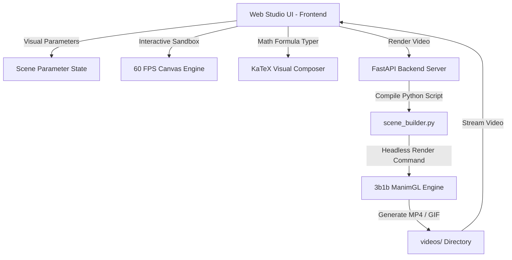

<p align="center">
  <a href="https://github.com/Zaki101Aslam/manim">
    
  </a>
</p>

<h1 align="center">MathMotion Studio (Built on ManimGL)</h1>

<p align="center">
  <strong>A Zero-Code, Plug & Play Visual Mathematical Animation Studio for Non-Programmers</strong>
</p>

<p align="center">
  <a href="https://github.com/Zaki101Aslam/manim/stargazers"></a>
  <a href="https://github.com/Zaki101Aslam/manim/blob/main/LICENSE.md"></a>
  <a href="https://github.com/3b1b/manim"></a>
  <a href="https://python.org"></a>
  <a href="https://www.w3.org/WAI/standards-guidelines/wcag/"></a>
</p>

---

## 💡 The Vision: Democratizing Mathematical Animation

[Manim](https://github.com/3b1b/manim) (created by **Grant Sanderson / 3Blue1Brown**) is arguably the most beautiful mathematical animation engine ever built. However, creating animations with traditional Manim requires extensive Python programming, object-oriented scene graph management, vector mathematics in code, and complex LaTeX syntax.

**MathMotion Studio** transforms Manim into a **frictionless, UI-based visual creator** for math lovers, teachers, students, and content creators who want to create 3Blue1Brown-quality animations **without writing a single line of code**.

---

## ✨ Key Features

### 1. 🧮 Interactive Mathematical Concept Modules
- **⚡ Collision $\pi$ Discovery (Galperin's Method)**: 
  - Discover the digits of $\pi$ by colliding blocks ($1\text{ kg}$ and $M = 100^{N-1}\text{ kg}$) against each other and a wall.
  - Interactive momentum physics, live collision counter, phase-space circular trajectory $(v_1, \sqrt{M}v_2)$, and sound effects (`clack.wav`).
- **📈 Calculus & Riemann Sums**: 
  - Interactive function graph with dynamic tangent line $f'(x)$ and adjustable Riemann rectangles (Left, Right, Midpoint) with live area calculation $\int_a^b f(x)\,dx$.
- **📐 2D Matrix Transformations**: 
  - Drag basis vector arrows $\hat{i}$ (green) and $\hat{j}$ (red) directly on the canvas to deform the 2D grid interactively.
  - Live determinant parallelogram area readout ($\det(A) = ad - bc$).
- **🌀 Fourier Epicycles (Drawing with Circles)**: 
  - Decompose closed 2D curves (Heart, Star, Circle, Infinity) into rotating harmonic circle vectors.
- **⭕ Trigonometry & Sine Wave Unwinding**: 
  - Visualize how harmonic sinusoidal waves emerge naturally from rotating points on a unit circle.
- **✨ Step-by-Step Formula Morphing**: 
  - Multi-step mathematical proof transitions (e.g. Euler's formula $e^{i\pi} + 1 = 0$) using Manim's `TransformMatchingTex`.

---

### 2. ⚡ Dual-Engine Architecture
1. **Instant 60 FPS HTML5 Canvas Engine**: 
   - Zero-delay interactive stage with timeline scrubbing, speed control ($0.25\times - 2.0\times$), play/pause, loop, and coordinate grid toggle.
2. **One-Click ManimGL Video Engine**:
   - Hit **"Render Manim Video"** in the top bar to run ManimGL headlessly in the backend and stream broadcast-quality 1080p/720p MP4 videos.

---

### 3. 🎯 Human-Centered Design & Nielsen Usability Heuristics
- **Direct Canvas Manipulation**: Click and drag blocks, tangent inspection points, or matrix basis vectors directly on the stage.
- **"Why This Works" Insight Cards**: Collapsible educational cards explaining the mathematical intuition behind every animation.
- **Visual Math Equation Composer**: Point-and-click symbol palette for integrals ($\int$), sums ($\sum$), roots ($\sqrt{}$), fractions, and Greek letters with live KaTeX preview.
- **Error Prevention & Freedom**: 1-click **"Reset Defaults"** button for every preset so you can experiment fearlessly.
- **Keyboard Shortcuts (Press `?`)**:
  - <kbd>Space</kbd> : Play / Pause
  - <kbd>R</kbd> : Reset to Start
  - <kbd>G</kbd> : Toggle Grid
  - <kbd>M</kbd> : Toggle Sound Effects
  - <kbd>1 - 6</kbd> : Quick-Switch Concept Presets

---

## 🚀 Quick Start (Plug & Play)

### Option 1: macOS Double-Click (Zero Terminal Setup)
Double-click **`start_studio.command`** in Finder.

### Option 2: Terminal / Cross-Platform

```bash
# Clone repository
git clone https://github.com/Zaki101Aslam/manim.git
cd manim

# One-command launch
./start_studio.sh
# or
python studio.py
```

Open **[http://localhost:8000](http://localhost:8000)** in your browser!

---

## 🏗️ Architecture



---

## 📦 Project Structure

```
manim/
├── start_studio.command    # Double-clickable macOS launcher
├── start_studio.sh         # Shell launcher script
├── studio.py               # Top-level CLI launcher & browser starter
├── server.py               # FastAPI backend API for rendering & video streaming
├── scene_builder.py        # UI-to-ManimGL Python compiler
├── collision_pi.py         # Standalone reference scene for Galperin Pi collisions
├── web/                    # MathMotion Studio Web Application
│   ├── index.html          # Main HTML UI with glassmorphism layout
│   ├── css/style.css       # Dark-mode styling, animations & accessibility
│   └── js/
│       ├── app.js          # App orchestrator, UCD tour & keyboard controls
│       ├── math_canvas.js  # 60 FPS HTML5 Canvas mathematical engine
│       └── math_typer.js   # Visual math equation composer (KaTeX)
├── manimlib/               # Core 3b1b ManimGL animation engine
└── videos/                 # Output directory for rendered videos
```

---

## 💖 Attribution & Credits

- **Manim Engine**: Created by [Grant Sanderson (3Blue1Brown)](https://www.3blue1brown.com/) and maintained by the 3b1b & Manim community ([github.com/3b1b/manim](https://github.com/3b1b/manim)).
- **MathMotion Studio**: UI-based mathematical animation studio designed to democratize Manim for non-programmers.

---

## 📄 License

This project is licensed under the [MIT License](LICENSE.md).
